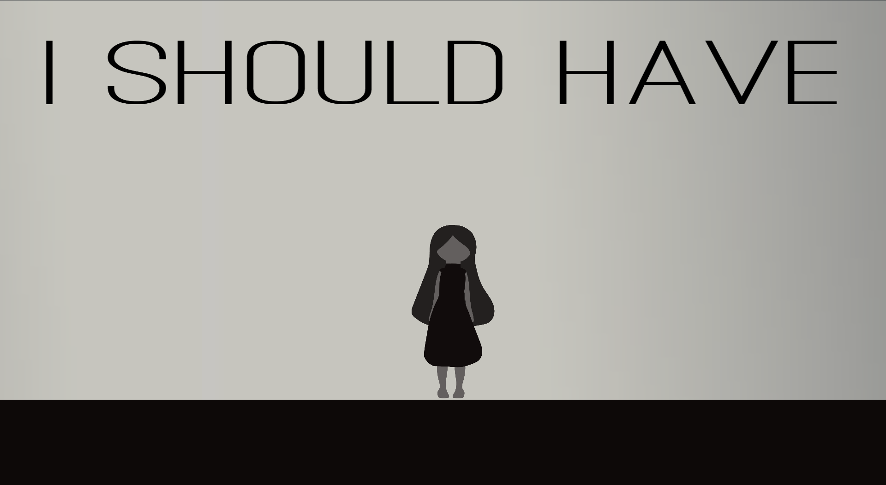

# I-should-have
It's unavoidable to do things we believe we shouldn't have done. But how often do we take actions to repair those things? 
This game (developed for GGJ '20) represents the repair of a girl's memories in order to restore her inner peace. 
The game contains several puzzles for the player to complete. The chosen development platform was the GODOT game engine.

## Controls:

Move: W/A/S/D
Jump: Space

## Developers:

- André Silva - [@Andrefpvs](https://github.com/Andrefpvs)
- Ariana Parrilha
- Anna Holzner
- Francisco Henriques Venda - [@ist173839](https://github.com/ist173839)
- Mariana Ribeiro
- Samuel Gomes - [@SamGomes](https://github.com/SamGomes)
